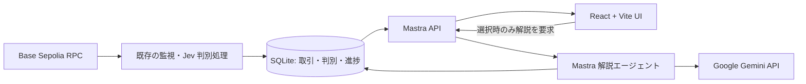

# 取引監視 UI 更新計画

## 目標と範囲

Base Sepolia の新着取引と Jev の判別結果をブラウザで追えるようにする。取引を選択したときだけ「詳しく解説」ボタンから Google Gemini に問い合わせ、日本語の説明を表示する。既存の `src/watch.ts`、`src/chain.ts`、`src/analyze.ts` の取得・デコード・判別処理を再利用し、CLI も使える状態を保つ。初期版はローカル利用を対象とし、ウォレット接続、取引の送信、公開デプロイは含めない。

## 画面の完成イメージ

- **上部:** 接続状態、監視中のチェーン、最新ブロック、処理待ちブロック数、直近の取得時刻を表示する。停止・再接続・エラーを見分けられる文言にする。
- **一覧:** 新しい順に取引ハッシュ、ブロック、実行結果、操作の日本語名、Jev の確信度、ブラックリスト照合状態を表示する。操作・`unknown`・`skipped`・ブラックリスト照合状態で絞り込み、ハッシュで検索できるようにする。
- **詳細:** 選択した取引の送信元・宛先・ETH 送付額、ABI 候補、イベント、Jev の確率分布、照合元の Ethereum ブロックを表示する。「確認済みの事実」と「モデルの推定」を別の領域に置く。トークン量は `decimals` が得られるまで最小単位と明記する。生 JSON は折りたたんで確認できるようにする。
- **解説:** 詳細画面に「詳しく解説」ボタンを置く。通信中・完了・失敗を表示し、回答は「要約」「根拠として使ったデータ」「不明な点」に分ける。説明の再実行は明示的な操作に限る。
- **使い分けの比較:** 詳細画面に「チェーン上の事実 → Jev の判断 → Gemini の解説」を同時に見られる領域を置く。各段階の入力、得られた結果、未確認の点を横並び（狭い画面では縦並び）にし、Gemini をまだ実行していないときは「未実行」と表示する。Jev の `unknown` と入力過大による `skipped` を別の例として示す。
- **見た目:** 監視卓を意識した落ち着いた暗色基調、読みやすい数字、状態を区別できる色と文字ラベルを採用する。狭い画面では一覧をカード化し、詳細は全画面表示にする。キーボード操作、フォーカス表示、色に頼らない状態表示を用意する。

## Jev と LLM の比較表示

| 段階 | 画面で示す内容 | 役割と表示上の注意 |
| --- | --- | --- |
| チェーン上の事実 | 送信元・宛先、実行結果、ABI 候補、イベント、ブラックリスト照合元 | RPC やコントラクトから取得したデータ。ABI の一致だけで規格への準拠を断定しない |
| Jev の判断 | `transfer` などの分類、候補ごとの確率、確信度、`unknown` / `skipped` | 全取引を定型の選択肢に分類。確信度を「正解率」と表現しない |
| Gemini の解説 | 日本語の要約、参照した事実、不明な点 | ボタンを押した取引だけ文章を生成。根拠のない断定は表示しない |

Jev と Gemini の欄には、それぞれの**モデル名、処理時間、入力・出力トークン数**を表示する。Jev の処理時間はモデル API 呼び出し部分を計測し、RPC 取得時間と混同しない。Gemini は生成時間を計測し、保存済みの説明を返した場合は「キャッシュを表示」と明記する。使用量が API から得られない場合は「取得不可」と表示し、推測で補わない。トークン数はモデル間の料金・精度を直接比較する数字ではないことを短く注記する。

デモには **送金を判別できた取引、`unknown` の取引、入力過大で `skipped` の取引**を用意する。3例を切り替えると、Jev が判断した場合、判断材料が足りない場合、モデルを呼んでいない場合の違いが分かるようにする。Gemini の説明は選択中の取引にだけ生成し、デモの模擬結果と実際の API 応答を明確に区別する。

## 構成



`tx-analiyze/src/` の既存処理を中核に残し、`src/mastra/` に API と解説エージェント、`src/storage/` に永続化、`web/` に React/Vite、`packages/contracts/` に API の型と検証スキーマを追加する。pnpm workspace に両パッケージを登録する。Mastra Studio は解説処理の開発・観測に使い、取引一覧は専用の React 画面で提供する。Mastra は [Google モデル](https://mastra.ai/models/providers/google)と[独自 API ルート](https://mastra.ai/docs/server/custom-api-routes)をサポートする。Vite には [React + TypeScript テンプレート](https://vite.dev/guide/)がある。

## データと API

- SQLite に `chainId + hash + blockHash` を識別子として、取引の事実、Jev の判別、`analysisStatus`、取得時刻を保存する。Jev のモデル名・API 呼び出し時間・既存の `usage` も保存し、`skipped` と `decode_only` では使用量を空欄にする。解説は取引識別子・モデル名・プロンプト版・根拠データのハッシュをキーに、Gemini の生成時間・取得できた使用量とともに保存する。同じ内容の再要求ではキャッシュを返す。
- 監視処理は1件を保存してから UI に更新を通知する。処理済みのブロック番号とハッシュを保存し、再起動後に未処理分から再開する。親ハッシュが変わったときは該当範囲を再確認し、既存結果を「再編成の可能性あり」として扱う。
- Mastra のルートとして `GET /api/transactions`（ページング・絞り込み）、`GET /api/transactions/:hash`（詳細）、`GET /api/transactions/events`（新着通知）、`POST /api/transactions/:hash/explanation`（説明の取得または生成）、`GET /api/health`（監視状態）を用意する。画面は初回に一覧を取得し、その後 Server-Sent Events で新着を反映する。切断時は再接続して一覧を再取得する。
- 説明要求はサーバー側で取引の存在と保存済みデータを検証する。連打による重複実行を防ぎ、リクエスト上限・タイムアウト・エラー表示を設ける。

## Google AI Studio の API キーと LLM

Google AI Studio で取得した **Gemini API キー**を、Mastra サーバーの `GOOGLE_API_KEY` に設定する。Mastra の Google モデルルーターがこの変数を読み取るため、初期モデルは `google/gemini-3.1-pro-preview` とし、モデル ID は環境変数で変更可能にする。既定モデルの Gemini API 利用には有料枠が必要で、無料枠では `google/gemini-3.8-flash` を指定する。Mastra の[対応モデル・環境変数](https://mastra.ai/models/providers/google)と、Google の[API キー設定方法](https://ai.google.dev/gemini-api/docs/api-key)を実装時に再確認する。既存の `TYPESAFE_API_KEY`、`ALCHEMY_RPC_URL`、任意の `ETHEREUM_RPC_URL` はサーバー側の設定として継続する。

```dotenv
# tx-analiyze/.env の例。実際の値はコミットしない。
GOOGLE_API_KEY=YOUR_GOOGLE_AI_STUDIO_KEY
GEMINI_MODEL=google/gemini-3.1-pro-preview
```

Vite の `VITE_*` 変数や React のコードにキーを置かない。説明エージェントには保存済みのデコード結果・イベント・Jev 判別・実行結果から、長さを制限した根拠データだけを渡す。出力は「要約、根拠の参照先、不明な点」の構造として検証する。ABI が不明な取引や `skipped` 取引については、分からない理由を説明し、calldata から未確認の処理を断定しない。ブラックリストの照合結果を LLM に再判定させない。説明文は推定として表示し、元データへ戻れるようにする。

## 実装順序と完了条件

1. **共通契約・保存:** 既存の判別結果を API 用スキーマに正規化する。SQLite と進捗チェックポイントを追加する。CLI の単発実行と `pnpm watch` の出力を壊さず、再起動時の重複と取りこぼしを検証する。
2. **Mastra API:** 一覧・詳細・新着通知・監視状態のルートを作る。空状態、RPC 障害、再接続、ブロック再編成を UI が区別できるレスポンスにする。
3. **React/Vite UI:** 一覧、検索・フィルター、詳細、各状態の表示と3段階の比較領域を作る。送金・`unknown`・`skipped` のデモデータを使い、広い画面とスマートフォン幅で操作を確認する。
4. **解説機能:** Mastra エージェントと Gemini を接続する。ボタン押下時のみ生成し、構造検証、キャッシュ、重複防止、失敗時の再試行を加える。Jev と Gemini の処理時間・取得できた使用量を比較領域に表示する。
5. **仕上げ:** API キーを画面・ログ・ビルド成果物に含めないことを確認する。型チェック・Biome・単体テストに加え、新着受信から詳細表示、解説生成までの操作テストを行い、README に起動手順を記載する。3つのデモ例で、未実行の Gemini に使用量が付かないこと、`skipped` を Jev の判断として表示しないことを確認する。

完了の判定は、ローカル起動後に新着取引が自動表示され、取引を選ぶと事実・Jev の判断・Gemini の解説を別々に確認でき、ボタンを押した取引に限って Gemini の解説が表示されること。送金・`unknown`・`skipped` の各例で段階と使用量が正しく表示され、画面の再読込後も履歴が残り、Google API キーがブラウザに渡らないことを確認する。
